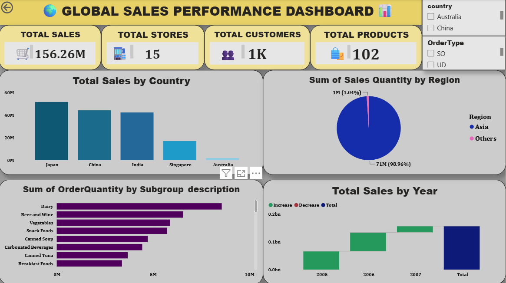

# 📊 Global Sales Performance Dashboard Using Power BI

## 📌 Project Overview

The **Global Sales Performance Dashboard** is an interactive business intelligence project developed using **Microsoft Power BI**.

The dashboard transforms raw sales data into meaningful insights related to sales performance, revenue, products, customers, regions, countries, and sales trends.

A **Star Schema data model** was implemented to organize the data efficiently and establish proper relationships between fact and dimension tables for accurate analysis and reporting.

---

## 🎯 Objectives

- Analyze overall global sales performance.
- Track important sales and business KPIs.
- Identify sales trends and patterns.
- Analyze region-wise and country-wise sales performance.
- Understand product performance.
- Analyze customer sales contribution.
- Compare sales across different time periods.
- Build an interactive and user-friendly dashboard.
- Demonstrate practical Power BI data modeling and visualization skills.

---

## 🛠️ Tools & Technologies

- **Microsoft Power BI**
- **Power Query**
- **DAX**
- **Star Schema**
- **Data Modeling**
- **Data Cleaning**
- **Data Transformation**
- **Data Visualization**

---

## Data Model – Star Schema

The project uses a **Star Schema** data model consisting of a central sales fact table connected to multiple dimension tables.

### Data Model Structure

```text
                    📅 Date
                       |
                       |
👥 Customer -------- ⭐ Sales Fact -------- 📦 Product
                       |
                       |
                 🌍 Geography
```


## Dimension Tables

The dimension tables provide different perspectives for analyzing sales data:

📅 Date Dimension – Time-based analysis
👥 Customer Dimension – Customer-level analysis
📦 Product Dimension – Product-level analysis
🌍 Geography Dimension – Region and country-level analysis
📊 Key Features
📈 Interactive Global Sales Performance Dashboard
💰 Sales and revenue analysis
📦 Product-wise sales analysis
🌍 Region and country-wise performance analysis
👥 Customer analysis
📅 Time-based sales trend analysis
📊 KPI cards for key business metrics
🔎 Interactive slicers and filters
📉 Trend and comparison analysis
🎨 Professional and user-friendly dashboard design

## 🔄 Project Workflow
Raw Sales Data
       ↓
Data Cleaning & Transformation
       ↓
Power Query
       ↓
Data Modeling
       ↓
Star Schema
       ↓
DAX Measures
       ↓
Interactive Visualizations
       ↓
Global Sales Performance Dashboard

## 📸 Dashboard Preview



---

## 🔍 Analysis Performed

The dashboard provides insights into:

- Overall sales performance
- Sales trends over time
- Region-wise sales performance
- Country-wise sales distribution
- Product-wise sales performance
- Customer-level sales analysis
- Revenue and business KPIs
- High-performing and low-performing areas
- Sales patterns and trends

---

## 💡 Key Insights

The dashboard helps identify:

- Which regions and countries generate the highest sales
- Which products contribute most to overall revenue
- Sales trends across different time periods
- Customer segments with higher sales contribution
- Areas with strong and weak sales performance
- Business trends that can support strategic decision-making

---

## 📈 Business Value

This dashboard provides management with a **centralized and interactive view of global sales performance**.

It enables users to quickly monitor KPIs, identify sales trends, compare regional performance, evaluate products and customers, and make **data-driven business decisions**.

---

## 📚 Skills Demonstrated

**Power BI | Power Query | DAX | Star Schema | Data Modeling | Data Cleaning | Data Transformation | Data Visualization | Business Intelligence | Dashboard Development**

---

## 📂 Project Files

| File | Description |
|------|-------------|
| `Sales_Dashboard.pbix` | Power BI dashboard and data model |
| `Sales_Dashboard.png` | Dashboard preview image |
| `README.md` | Project documentation |

---

## ⭐ Project Highlights

An interactive Power BI dashboard built using a **Star Schema data model** to analyze global sales performance and generate meaningful business insights through data modeling, DAX, and visualization.

## 👩‍💻 Author

**Gayathri R**

Aspiring Data Analyst

### Technical Skills

**Excel | SQL | Power BI | Python**

---
